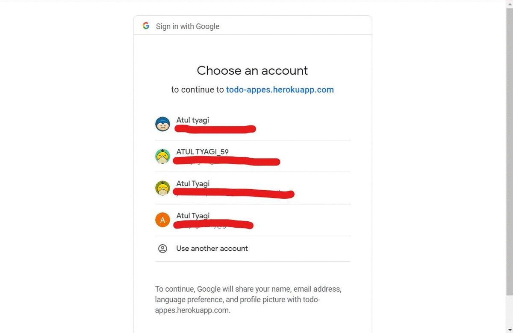

# To-do App
A To-do app using Nodejs , express , mangodb , googleauth

This repository contains code for To-do App using Nodejs , express , mangodb , googleauth

Technology used : -Nodejs -express 

# Dependencies 

```
Nodejs
express
express-session
method-override
mongoose
dotenv
connect-mongo
passport
passport-google-oauth20
path
```

# Demo
fill the Todo-App/config/config.env with MONGO_URI , GOOGLE_CLIENT_ID , GOOGLE_CLIENT_SECRET and then 

Run by ``` npm run dev  ```

[VIEW DEMO](http://todo-appes.herokuapp.com/)


